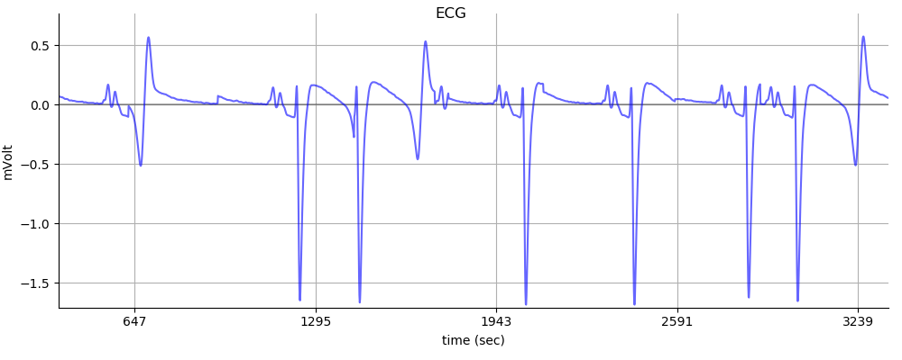
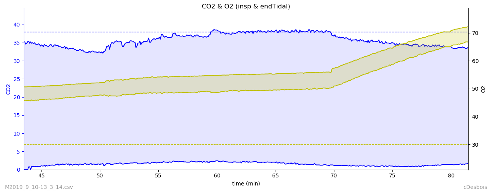
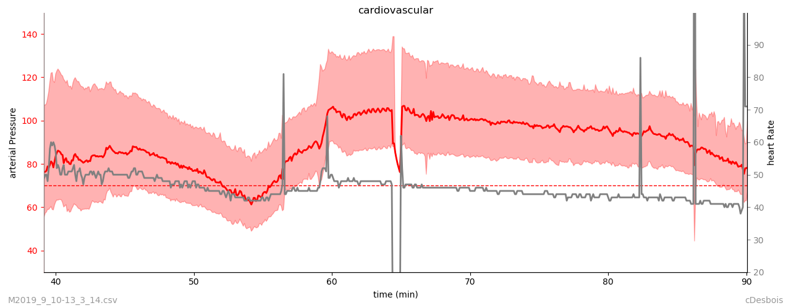
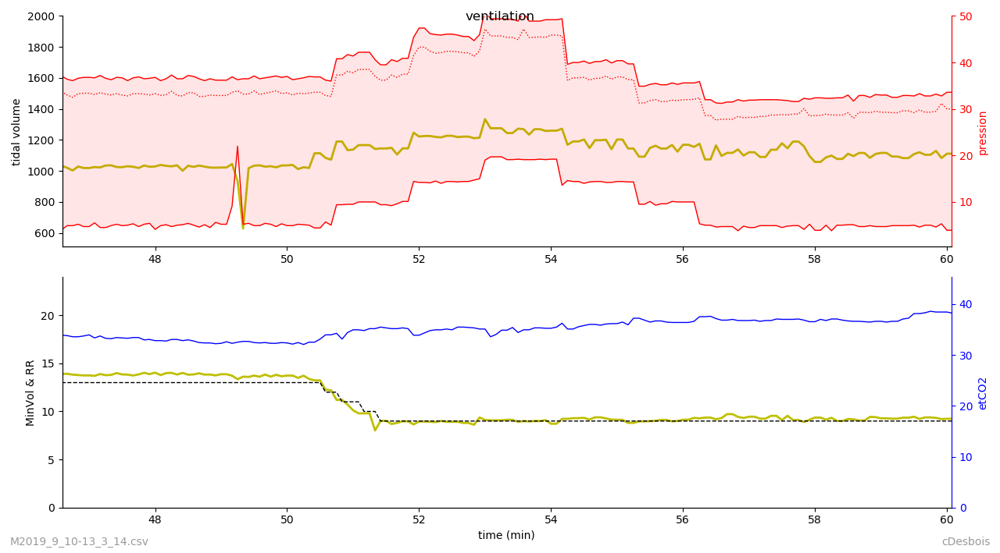

# anesthRecord : a set of python functions to read, display and analyse anesthesia data

I developed it essentially for teaching purposes
The scripts were used to build visualisation of physiological
cardiovascular & respiratory parameters recorded during equine anesthesia
(heart rate, arterial pressure, capnometry, ...)
Generated plots include trends & wave, as pictures or videos

## input files
Input files should be (.csv) recordings obtained during clinical by the use of
- Monitor software connected to a DatexAS3 anesthesia machine
(see http://www.cuhk.edu.hk/med/ans/softwares.htm)
This generated tends (~1pt/5sec) and waves (~300pt/sec) recordings
- Taphonius software (trends) (see https://vetronic.co.uk)

## settings
1. you need a python >3 ditribution

   some  additional packages can be required

	```bash
	pip install pyyaml
	```

 	conda install -c conda-forge pyperclip,
 	```

2. download the repository

3. build a configuration .yaml file trough the buildRecordRC.py
* navigate to the repository
* run > "python buildRecordRC.py" inside the repository)
(it will define a paths directory for the data locations (data)
 and the folder to save the plots if required (sFig, ...)
ie should create 'recordRC.yaml' in the same folder as 'recordMain.py)
NB (install the missing packages if necessary)

## using the code as a module

to be able to manipulate the data (trends & waves) 

``` python
# move to anesthPlot
$ ipython

import anesplot.record_main as rec
trends = rec.MonitorTrend()
trends.show_graphs()
...
wavename = rec.trendname_to_wavename(trends.filename)
waves = rec.MonitorWave(wavename)
waves.plot_wave()
...
```


## using the code from terminal

to obtain a rapid view of the data for visualisation or to save the plots

1. run anesplot as a module : open a terminal

   - either navigate to anesthPlot folder and run

   ````bash
   $ python -m anesplot
   ````

   - or run from any location (make an alias un the .bashrc)

   ````bash
   alias record='PYTHONPATH=<pathToAnesthPlot> python -m anesplot
   ````
* choose the file you want to load
* select the kind of file
* (nb for Taphonius recordings, you will be prompted to choose a second file that correspond to the patient data)
2. pictures will be generated:
   1. for trend data
    a. description of the case
           (text entered during the setup of the recording)
    b. general analysis of the procedure
            (histogram of heart rate & arterial pressure)
            (histogram of etco2 & isoflurane used)
    c. display of the trends parameters
            (scale can be adjusted and pictures can be saved)
     2. for the wave data
        a. you will be prompted to choose a wave to be displayed

# example of pictures generated










